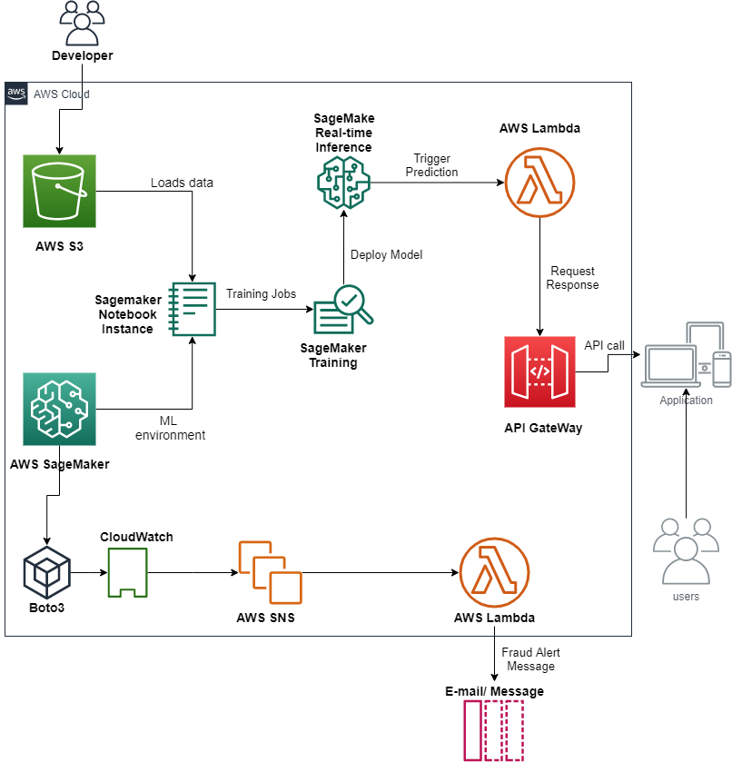

# fraud-detection-SageMaker
(Credit card fraud detection with AWS Sage maker and deployed on AWS Cloud9)

### Intro:
In another repository [[here](https://github.com/jithendrabsy/credit-card-fraud-detection)], I used various machine learning and deep learning models to solve the problem. But in this repository, the main goal is to understand the complete machine learning work flow (from data collection, data storing, data preprocessing, model selection, training and finally to model deployement) using **AWS SageMaker**. I first deployed the model locally using Flask and then also deployed it on **AWS Cloud9 environment**.

 

### Dataset:
[Credit Card Fraud Detection](https://www.kaggle.com/mlg-ulb/creditcardfraud) on Kaggle

### Process Overview

1. Upload the dataset to S3, which has to be loaded into SageMaker.
2. Train the machine learning job on SageMaker.
3. Deploy model with SageMaker.
4. Create endpoint on SageMaker which can be invoked by AWS Lambda.
5. Use API Gateway to create API to send requests between application and API Gateway.
6. API Gateway sends request to Lamnda which invokes prediction job on SageMaker endpoint.
7. AWS SageMaker gives the result from API back to the Application.
8. Build a Flask app and pass the invoke API URL to the app
9. Run it locally (at localhost://5000)
10. Import the app to AWS Cloud9 platform, install the requirements and run it on cloud to deploy the app on a webpage.

**Note:**
Flowchart made with draw.io - XML file of the chart [here](https://github.com/jithendrabsy/fraud-detection-SageMaker/blob/master/flow-chart.xml).

### Results:
For screenshot of app running both locally and on cloud9 - [watch this](https://github.com/jithendrabsy/DS-ML-Projects/blob/main/aws-SageMaker-fraud-detection/result-Screenshots.md)
