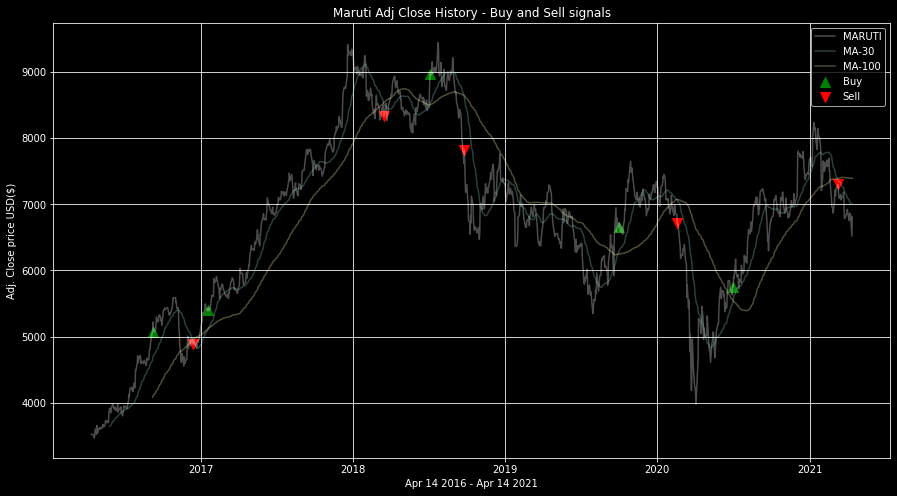
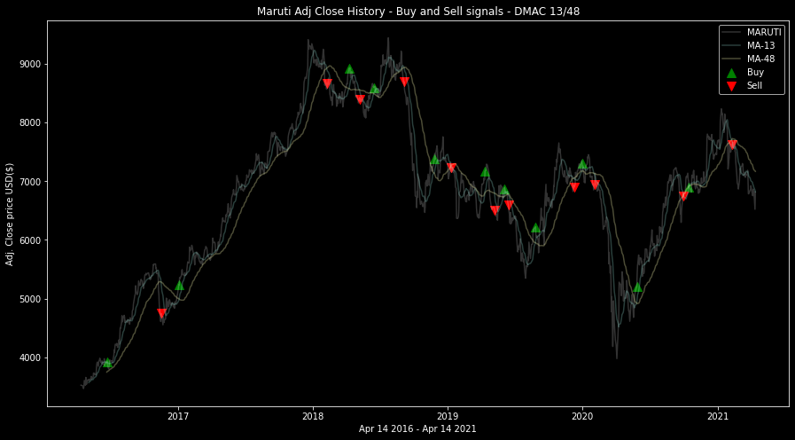
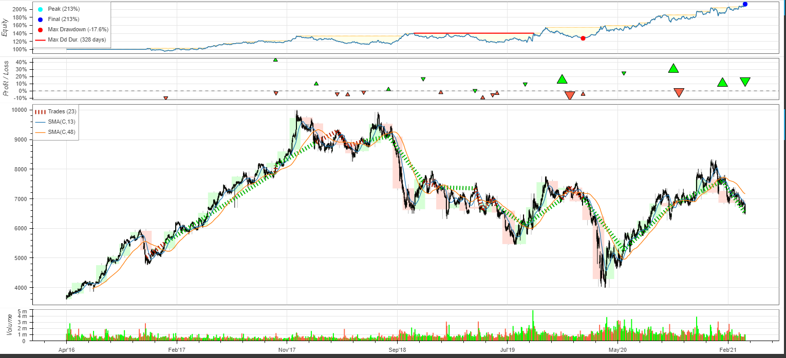

# Buy or Sell Stocks?
##### using Dual Moving Average Crossover Strategy

Predicted when to buy or sell stocks using simple dual moving average crossover strategy. And then backtested it over 5 years of MARUTI stock.

### What is Dual Moving Average Crossover strategy?
It uses two moving averages, a short period and long period one. When the short period moving average crosses over the long period one, a signal is generated to enter the market in the direction of the crossover.
- if short MA crosses the long MA in an upward direction - BUY signal
- if short MA crosses the long MA in a downward direction - SELL signal

### Strategy 1 - DMAC 30/100

window1 = 30 days
window2 = 100 days

- When backtested this strategy over past 5 years of MARUTI stock - this returns a 78% of your investment in 5 years.

### Strategy 2 - DMAC 13/48

window1 = 13 days
window2 = 48 days

- When backtested this strategy over past 5 years of MARUTI stock - this returns a 113% of your investment in 5 years.

A return of 113% in 5 years is very good, which is obtained by using Dual Moving Average Crossing strategy with short and long windows 13 and 48 respectively. 30/100 window selection strategy is also not so ad because 78% return in 5 years is not bad and even this is more trustworthy than the 13/48 strategy.

I used random window lengths. I used 13 and 48 because - "A study discovered that trading the crossovers of the 13-day and 48.5-day averages produced the largest returns". [1]

However - It is up to the trader to choose the number of days to which the two moving averages are set. This should be done after testing and evaluating the system thoroughly in the recommended way, using the trader’s method.

### Libraries Used - 
- Numpy
- Pandas
- Matplotlib
- Bokeh
- [yfinance](https://github.com/ranaroussi/yfinance) 
- [backtesting.py](https://kernc.github.io/backtesting.py/)

---

**Note: This is purely for learning purposes. I am not responsible for any profit/loss you make using this. You should consult your financial advisor before any trading decision! (lol!)**
