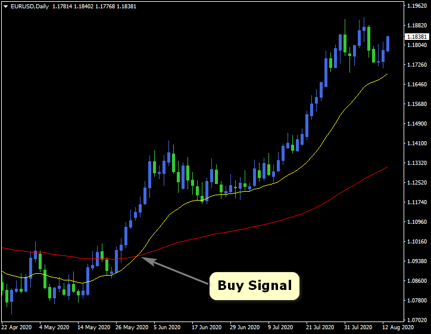
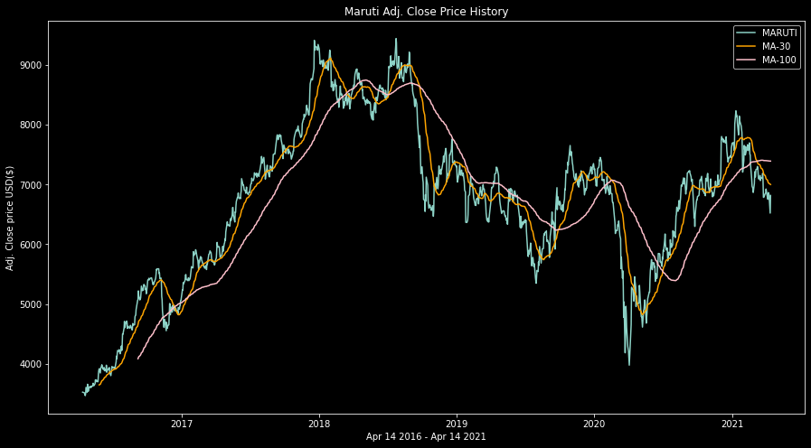

# Buy or Sell Stocks?
##### using Dual Moving Average Crossover Strategy

Predicted when to buy or sell stocks using simple dual moving average crossover strategy. And then backtested it over 5 years of MARUTI stock.

### What is Dual Moving Average Crossover strategy?
It uses two moving averages, a short period and long period one. When the short period moving average crosses over the long period one, a signal is generated to enter the market in the direction of the crossover.
- if short MA crosses the long MA in an upward direction - BUY signal
- if short MA crosses the long MA in a downward direction - SELL signal

### Strategy 1 - DMAC 30/100

