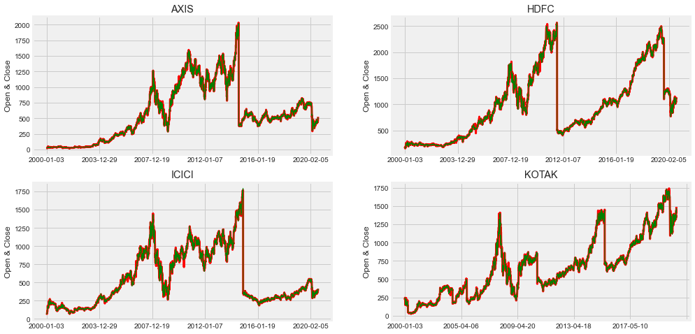
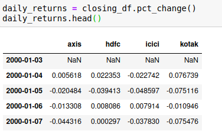
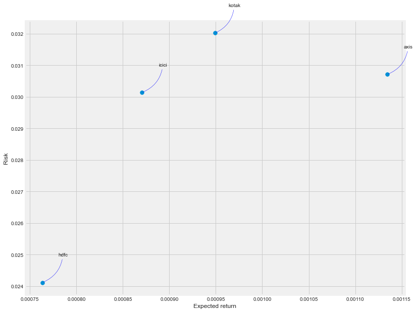
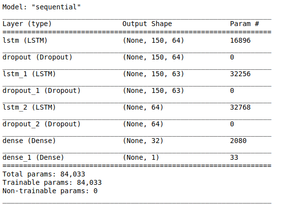
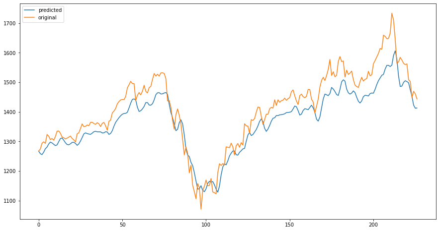
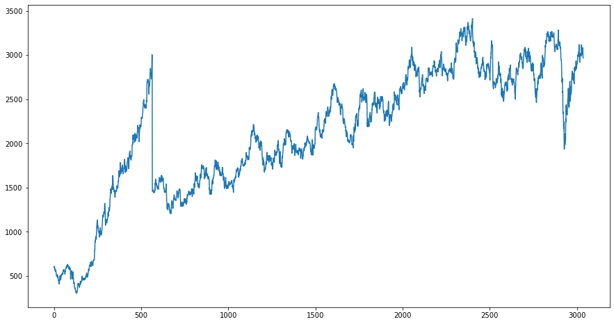
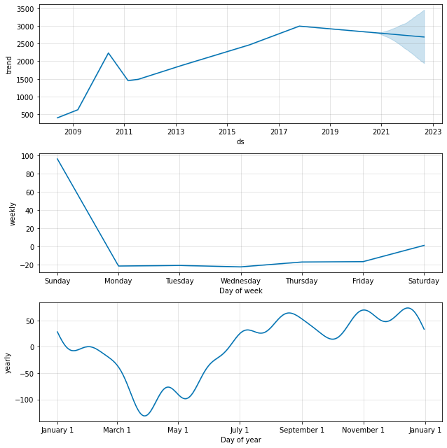

# Stock data Analysis and Forecasting

## Introduction:
Stock forecasting is the process of determining the stock prices in future time periods based on past historical stock prices.

This repo is my work with historical data of the stock prices of some publicly listed companies and implemented a forecasting model based on Long Short Term Memory(LSTM) and also Facebook's Prophet in order to predict the future prices.

## Exploratory Data Analysis
This [notebook](banks-eda.ipynb) explores basic exploratory data analysis over the stock data to understand the structute of data and some other imortant factors. This notebook explores the correlation between the closing prices of these four banks, how VWAP and other features are varying with time, and also the variations of Moving Averages of VWAP.

**Datasets used for EDA**: Stock prices of four popular Indian banks (Axis, HDFC, ICICI and Kotak). ([SOURCE](https://www.kaggle.com/rohanrao/nifty50-stock-market-data?select=KOTAKBANK.csv))

The columns present in the dataset are:-

Important features from any Stock market data are: 
* **Open** and **Close** columns indicate the opening and closing price of the stocks on a particular day.
* **High** and **Low** columns provide the highest and the lowest price for the stock on a particular day.
* **Volume** column tells us the total volume of stocks traded on a particular day. 
* **Volume Weighted Average price**(VWAP) is a trading benchmark used by traders that gives the average price a security has traded at throughout the day, based on both volume and price. It is important because it provides traders with insight into both the trend and value of a security([source](https://www.investopedia.com/terms/v/vwap.asp)).

Stock insights from the bank datasets:-

variation of VWAP along time: 

variation of Open and Close prices along time: 

variation of High and Low along time: 

**Moving Averages**:
The moving average (MA) is a simple technical analysis tool that smooths out price data by creating a constantly updated average price. The average is taken over a specific period of time, like 4 days, 16 days, 12 weeks or any time period the trader chooses.

**Correlation between different banks closing prices!**

Correlation matrices are an essential tool of exploratory data analysis. They contain the information regarding which variables are correlated, to what degree, and in which direction.

ICICI and AXIS have the strongest correlation of daily closing prices. It's also interesting to see that all the banks are positively correlated.

**Daily returns** are the percentage change in the closing prices. I collected closing prrices of all the four banks into a new dataframe, and used *pct_change()* to fing the daily returns. 

Now, How much value do we put at risk by investing in a particular bank stock?

There are many ways we can quantify risk. One of the most simple ways is by using the information of daily percentage returns and comparing the expected return with the standard deviation of the daily returns.

## Forecasting

**Methods used**: Long Short Term Memory(LSTM) and also Facebook's Prophet

### 1. Long Short Term Memory(LSTM)
**Data used:** Google's stock data.

**Data collection:** Collected using [Pandas Datareader](https://pandas-datareader.readthedocs.io/en/latest/remote_data.html) with the help of **[Tiingo](https://www.tiingo.com/)** API.

**Aim:** To forecast the high prices of Google for the next 90 days.

**Libraries Used:** Numpy, Pandas, Matplotlib, Scikit-learn, Keras, Tensorflow

Variation of High prices along the time:

**Scaling:** Scaling is important because LSTMs are sensitive to scale of the data. It refers to putting the values in the same range or same scale so that no variable is dominated by the other. I used [MinMax Scaler](https://scikit-learn.org/stable/modules/generated/sklearn.preprocessing.MinMaxScaler.html) Transform features by scaling each feature to a given range.

**Note:** Reshaping the data into 3-dimensional is important because LSTM takes 3-dimensional input.

Detailed blog about LSTM by Colah can be found - [here](https://colah.github.io/posts/2015-08-Understanding-LSTMs/)
 
Architecture of the model :-

The model is trained for 250 epochs!

Comparision between the model's predicted high prices of the test data and the original high prices of the test data.

Now, forecasting the high prices for the next 90 days:-

### 2. Facebook's Prophet
**Data used:** stock prices data of BAJAJ-AUTO ([source](https://www.kaggle.com/rohanrao/nifty50-stock-market-data?select=KOTAKBANK.csv))

**Aim:** To forecast the closing prices of Bajaj-Auto for the next 2 years.

**Libraries used:** Numpy, Pandas, Matplotlib, Seaborn, fbprophet

Variations of the closing prices along the time:

**Prophet:**

Prophet is Facebook's library for time series forecasting. Prophet works best with datasets that are higely influenced by seasonality such as electricity bills, rainfall patterns. It is very simple to use Prophet for forecasting.

Learn more about Facebook's Prophet from - [here](https://facebook.github.io/prophet/)

Forecasting the closing prices for the next 2 years:-

Trends in Bajaj-Auto's stock price:

* Bajaj's stock price is showing signs of decreasing trend in the future. 

## Conclusion:
This is a playground project where I explored time series data of historical stock prices of some publicly listed companies. I successfully predicted forecasted the future stock prices of some companies. I used both LSTM based model and Facebook's Prophet for performing the forecast. 
