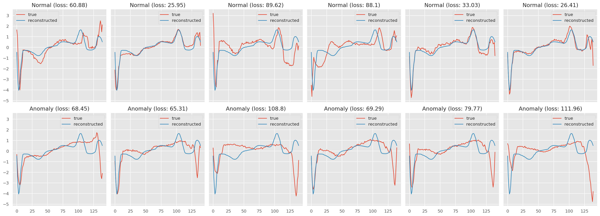

# Heartbeat anomaly detection

## Overview:
The aim of this project is to distinguish anomalies in heartbeats using LSTM Autoencoder.

## Dataset:
- Downloaded the dataset from [Time series classification](http://timeseriesclassification.com/description.php?Dataset=ECG5000) website.
- The data was already pre-processed in two steps: (1) extract each heartbeat, (2) make each heartbeat equal length using interpolation.
- The dataset contains 5000 time series sequences with 140 timestamps obtained with ECG and corresponds to heartbeats from a single patient.

---

- Trained and evaluated autoencoder,chose a threshold for anomaly detection and finally classified unseen examples as normal or anomaly with 95% accuracy.
- The model might be overfitting the data rightnow, I am currently tuning the model to correct this.
- I will update the correct model very soon.
- Detailed README is in progress :)

## Predictions on unseen data:

