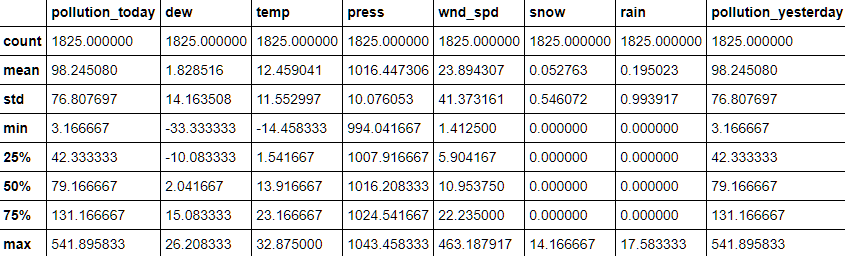
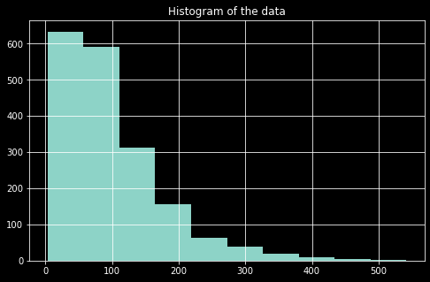
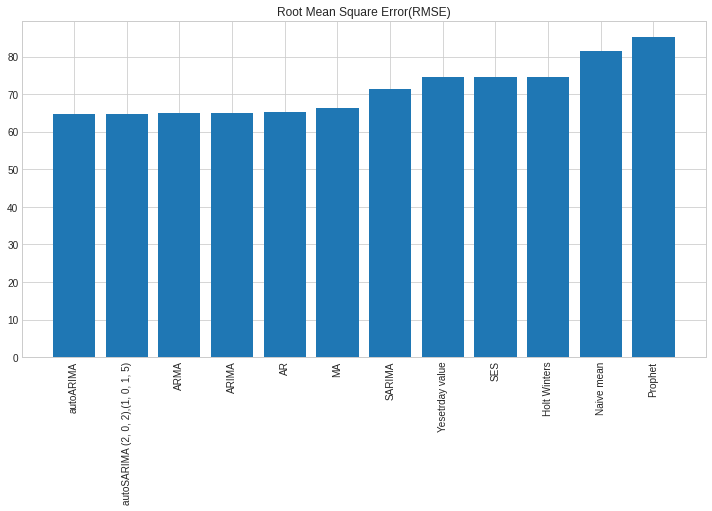
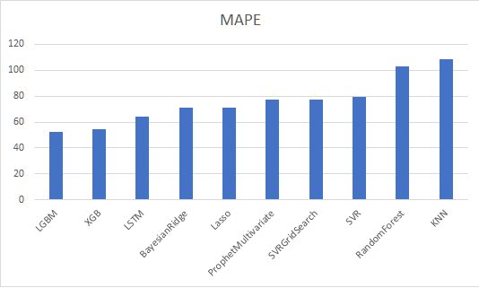

# Forecasting Air pollution


### About
In this project, I explored various models for forecasting time series. I then compared the performance of the models over two different metrics. 

### UseCase and Dataset:
I forecasted the amount of pollution in air based on  the historical pollution data. I used Beijing pollution public dataset - which contains data from 2010-14, along with extra weather features such as temperature, windspeed, pressure etc. 



### Notebooks
- [Statistical Univariate models](https://nbviewer.jupyter.org/github/jithendrabsy/Side-Projects/blob/main/mini-projects/forecasting-air-pollution/models/UnivariateModels.ipynb)
- [Multivariate ML models](https://nbviewer.jupyter.org/github/jithendrabsy/Side-Projects/blob/main/mini-projects/forecasting-air-pollution/models/ML_Models.ipynb)

### Data Analysis

Analysing time series data before any modeling is very important. This gives an idea of trend and seasonality present in the dataset if any.

Let's see how our target feature is distributed:


#### Decomposition of the target feature:

Analyzing time series helps to understand the patterns such as trend, seasonality,cyclicality and irregularity. **Trend** is a general direction the data is changing as time passes. **Seasonality** is when a pattern recurs over fixed regular time intervals. **Cyclicality** is when there are any fluctuations around the trend. Unlike seasonality, cyclicality may vary in length. **Irregularity** is when there are random fluctuations which are not systematic and are irregular. These fluctuations cannot be controlled. These are called as time series components.

It is important to analyze these components carefully in order to better understand the problem during analysis or forecasting. Since it is difficult to see all the components in a time series, a method called **Decomposition** can be used to identify them.

This can be done with statsmodels' **seasonal_decompose()** function:

```python
from statsmodels.tsa.seasonal import seasonal_decompose
components = seasonal_decompose(df['TEARGET'], model='multiplicative')
components.plot()
pyplot.show()
```


#### Checking the data distribution



The distribution is not Gaussian - so not a zero mean and not a constand standard deviation

#### Checking for Stationarity
If all the statistical characteristics of data like mean, auto correlation, variance do not vary with time then the time series is called stationary.

### Modeling

I performed both univariate forecasting and Multi-variate forecasting on the dataset.

#### Performance metrics considered:

1. MAPE - Mean Absolute Percentage Error
2. RMSE - Root Mean Square Error

```python
def mape(y_true, y_pred): 
    y_true, y_pred = np.array(y_true), np.array(y_pred)
    return np.mean(np.abs((y_true - y_pred) / y_true)) * 100

from sklearn.metrics import mean_squared_error


def rmse(y_true, y_pred):
    y_true, y_pred = np.array(y_true), np.array(y_pred)
    return np.sqrt(mean_squared_error(y_true, y_pred))
``` 

#### Univariate Analysis and Forecasting:
If only a single variable is varying over time, it is called Univariate time series. In the first part of this experiment, I only considered the pollution target and modeled the data with classic statistical models.

**Models experimented:**
- Naive mean
- Exponential Smoothing
- Holt winter's
- AR
- MA
- ARMA
- ARIMA
- auto-ARIMA (using pmdarima module)
- SARIMA
- auto-SARIMA
- FbProphet

  

It is observed that ARIMA and SARIMA models out-performed remaining statistical time series models. I wonder why Prophet stood last in the list! I think I didn't perfectly modelled the data with FbProphet. I'll still have to experiment with Prophet's parameters to improve its performance. Because - I really adore the power FbProphet in forecasting time series data.

#### Multivariate models
If there are more than one variable varying over time, it is called Multivariate time series. In the second part of this experiment, I considered all other features along with pollution. Most of the real world data is always multi-variate - and with intuition one can say that air pollution content (Air Quality Index) will depend on external factors too.

Before experimenting models, it is important to prepare dataset ready for machine learning algorithms.

**Feature Engineering:** Adding new features dataset might always be helpful for machine learning models. I added few features based on date and time like - hour, date, day of week, week number, dayOfMonth, dayOfYear etc..

**Feature Scaling:** Used sklearn's Standard Scaler to scale all the data observations, because this reduces variance of observations and helps models to better capture the patterns in time series.

**Models experimented:**
- Bayesian Ridge Regression
- Lasso Regression
- Random Forest
- SVM
- SVM + GridSearched parameters
- kNN
- XGBoost
- LightGBM
- FbProphet (multivariate)
- LSTM

  

It is observed that LGBM, XGB and LSTM out-performed remaining machine learning models.

#### Ensembling
Ensembling refers to combine different multiple models to achieve a better performance. I observed correlations between the predictions of top-3 models (LGBM, XGB  and LSTM) and found that there is small correlation. So, ensembling these models will make sence. I ensembled them with equal weights and formed four new model combinations:

- LGBM + XGB
- XGB + LSTM
- LGBM + LSTM
- LGBM + XGB + LSTM

#### Comparision of all models


| Model      | MAPE     | RMSE    |
| :------------- | :----------: | -----------: |
| XGB+LGBM+LSTM	| 53.148997	| 39.068575| 
| XGB+LSTM	| 55.417591	| 39.380731| 
| LGBM+LSTM	| 55.058945	| 39.970314| 
| XGB+LGBM	| 52.018048	| 41.66026| 
| LGBM	| 52.233762	| 42.745285| 
| XGB	| 54.214471	| 43.195546| 
| LSTM	| 64.259572	| 45.891005| 
| SVRGridSearch	| 77.677857	| 50.340027| 
| ProphetMultivariate	| 77.415609	| 51.01606| 
| Lasso	| 70.903118	| 54.583998| 
| BayesianRidge	| 70.787398| 	54.634477| 
| SVR	| 79.422351	| 56.0328| 
| RandomForest	| 102.927586	| 59.448943| 
| autoARIMA	| 100.225573	| 64.712253| 
| autoSARIMA,(2, 0, 2),(1, 0, 1, 5)	| 95.282644	| 64.771239| 
| ARMA	| 100.56446	| 64.861694| 
| ARIMA	| 100.56446	| 64.861694| 
| AR	| 101.559338	| 65.321718| 
| MA	| 105.286912	| 66.201675| 
| SARIMA	| 90.600687	| 71.325061| 
| Yesetrday value	| 104.404971	| 74.522764| 
| SES	| 111.262657	| 74.671731| 
| Holt Winters	| 111.262657	| 74.671731| 
| KNN	| 108.29365	| 80.387336| 
| Naive mean	| 132.13573	| 81.44436| 
| Prophet	| 129.989129	| 85.090377| 

Models yet to experiment with:
- GlutonTS
- sktime - library
- CNN
- LSTM + CNN

##### Thank you for reading ;)
