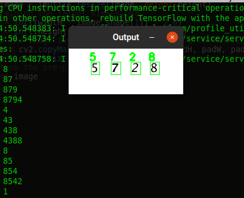
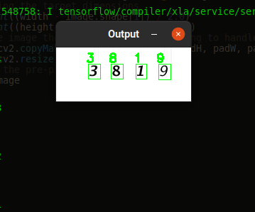

# Reading Captcha with a Neural Netowrk

**Aim:** Read the captchas from images by detecting numbers!

### How to Run:
1. Clone the repo
2. `pip install -r requirements.txt`
3. Extract `downloads.zip`
4. `python test.py --input downloads --model lenet.hdf5`

A glimpse of output:-

