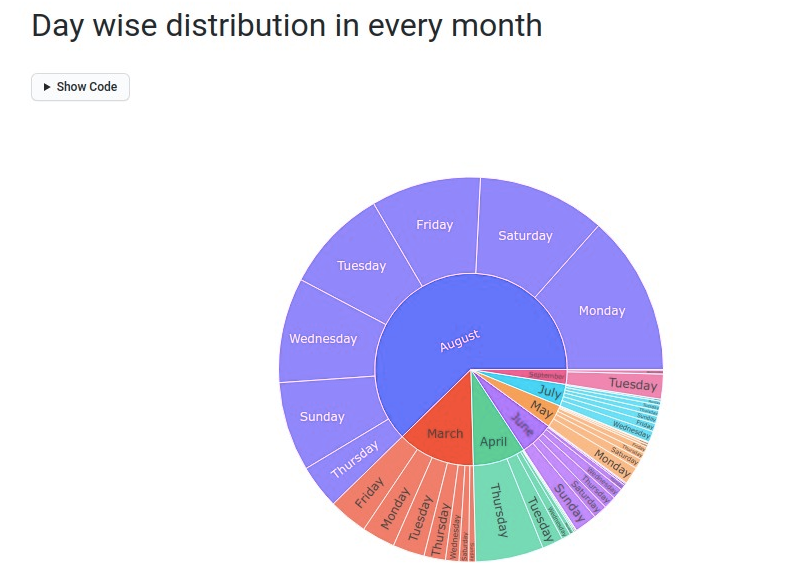

# whatsapp-group-chat-analysis

In this fun project, I decided to try my hands on text data for the 1st time. I analysed the text data from a whatsapp group of my friends! I performed some basic cleaning and then analysis. Whatsapp has an option export the chat into .txt file! I used that to extract the group chat messages! 

- [nbviewer](https://nbviewer.jupyter.org/github/jithendrabsy/Side-Projects/blob/main/mini-projects/whatsapp-group-chat-analysis/whatsapp-group-chat-analysis.ipynb)

Note: interactive Plotly are not being rendered on github and nbviewer! 

Some of the analsis plots are:-

And many more!
