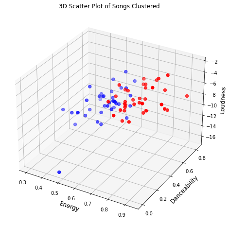

## Clustering songs based on features

### What?
The goal of this to automatically divide a whole playlist of songs into to different playlists of different moods/features like - energetic songs and relaxing songs!

### Why?
- I sometimes want to listen relaxing songs of my favorite artists and sometimes more energetic and loud songs.
- It is hard to manually seperate songs from every album.. So, I performed clustering.

### How?
- I extracted the whole discography of my favorite arists into a csv file using Spotipy.
- I used **KMeans** algorithm to cluster all the songs of an artist into two clusters - Relaxing and Energetic.
- I clustered the songs into two clusters using 3 features - Energy, Danceability and Loudness.

### Results?
- Using Spotipy, I then automatically added the clusters back to my spotify library as seperate playlists.
- I clustered Tyler, The Creator's discography into energetic and relaxed playlists.
- You can find them here -
  - [Tyler Energetic](https://open.spotify.com/playlist/0h0drDaNNApUxP1PUFIdqC?si=LbiyjhekTAyGJjxtJqMjUg)
  - [Tyler Relaxed](https://open.spotify.com/playlist/5YlCHh1aXlYSqG0yApGLH7?si=kXfHtb6MQFKl6BeWUlJ8mg)
  

  
  

