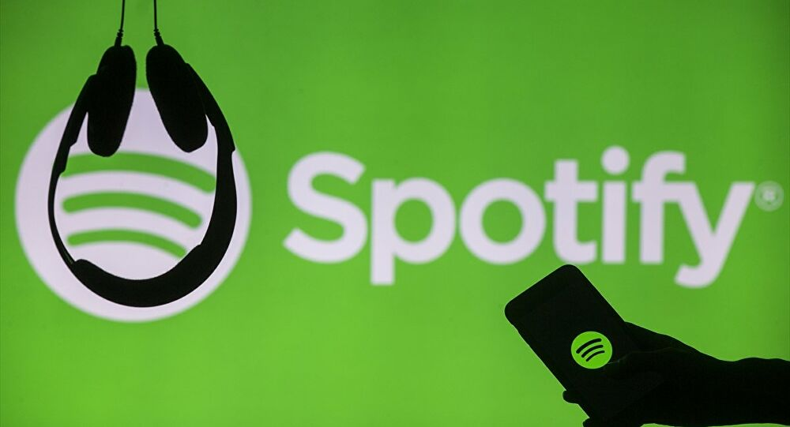

## When Music meets Data Science

This repository is a collection of projects where I explored data from music industry.

### 1. [What's common between top songs on Spotify from 2010-19](https://github.com/jithendrabsy/DS-ML-Projects/tree/main/when-music-meets-datascience/analyzing-top-spotify-songs_from-2010-19)

- I performed another analysis on top songs on Spotify charts from 2010-19.
- For this, I found a dataset on Kaggle. [here](https://www.kaggle.com/leonardopena/top-spotify-songs-from-20102019-by-year)
- See the project directory - [here](https://github.com/jithendrabsy/DS-ML-Projects/tree/main/datascience-meets-music/Analyzing_top_Spotify_songs_from_2010-2019)
- For interactive kernel on Kaggle - see [here](https://www.kaggle.com/saiyan6174/eda-on-top-spotify-songs)

### 2. [Analyzing my personal Spotify streaming history](https://github.com/jithendrabsy/DS-ML-Projects/tree/main/when-music-meets-datascience/analyzing-my-music-taste-variation)

- I analyzed my spotify streaming history to understand how my music taste is varying over time.
- I collected my streaming history using [Spotipy](https://spotipy.readthedocs.io/en/2.16.1/) which is a light weight client to extract many features from Spotify's web API.
- This helped me to find out my top songs, artists, genres and time I am spending on each of them.
- I then compared my music preferences to top 50 songs of 2019 to see how different my taste is from the world's general preferences.
- See the project directory - [here](https://github.com/jithendrabsy/DS-ML-Projects/tree/main/datascience-meets-music/analyzing-my-music-taste-variation)

### 3. [Analyzing music discographies of my 2 favorite artists](https://github.com/jithendrabsy/DS-ML-Projects/tree/main/when-music-meets-datascience/analyzing-favorite-artists)
- I collected the artist data of [Tyler, the creator](https://open.spotify.com/artist/4V8LLVI7PbaPR0K2TGSxFF) and [Black Sabbath](https://open.spotify.com/artist/5M52tdBnJaKSvOpJGz8mfZ) using Spotipy.
- I then analyzed how each album is different from others.
- This if done in large scale helps artists to predict what type of albums they should do to gain more popularity in fans.

### 4. [Clustering songs based on features](https://github.com/jithendrabsy/DS-ML-Projects/tree/main/when-music-meets-datascience/clustering-songs-based-on-features)
- I sometimes want to listen relaxing songs of my favorite artists and sometimes more energetic and loud songs.
- It is hard to manually seperate songs from every album.. So, I performed clustering.
- I used **KMeans algorithm** to cluster all the songs of an artist into two clusters - Relaxing and Energetic.
- Using Spotipy, I then automatically added the clusters back to my spotify library as seperate playlists.

### 5. [Songs recommender system](https://github.com/jithendrabsy/DS-ML-Projects/tree/main/when-music-meets-datascience/songs-recommender)
- I had built a recommendation system using data I found on kaggle.
- If I want to get n songs similar to my favorite song, I could get them.
- I calculated cosine siimilarity between song lyrics at word level with the help of TF-IDF Vectorizer.
- I had built only Content based recommender as of now, I am trying to build a Collaborative recommender. (soon)

******

