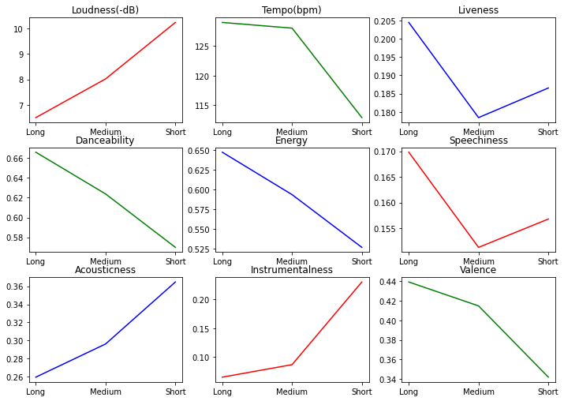

## Analyzing my personal Spotify streaming history [in progress]

### What?
This directory shows some insights about my personal spotify streaming history.

### Why?
I know that my music taste changed a lot in past three years, So I wanted to see how it changed over time. And I also wanted to compare how my music preferences are 
similar/different from the world's best picks(2019 Top songs).

### How?
- I followed [this](https://github.com/vlad-ds/spoty-records) to extract my spotify streaming history and related features.
- I analyzed my spotify streaming history to understand how my music taste is varying over time.
- I collected my streaming history using Spotipy which is a light weight client to extract many features from Spotify's web API.
- This helped me to find out my top songs, artists, genres and time I am spending on each of them.
- I then compared my music preferences to top 50 songs of 2019 to see how different my taste is from the world's general preferences.

### Some insights!

**Variation in my music taste over time:**

