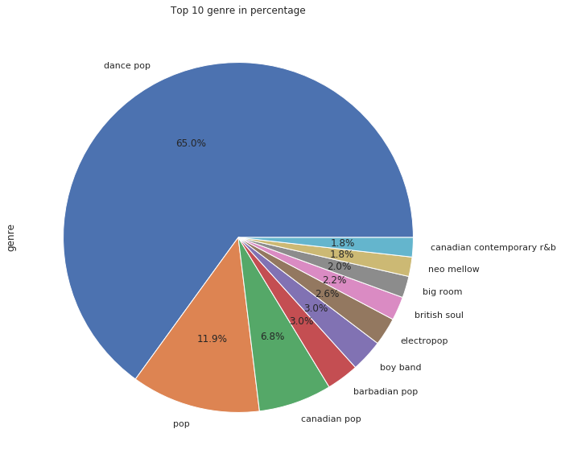
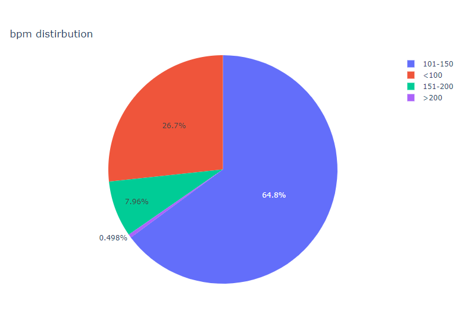
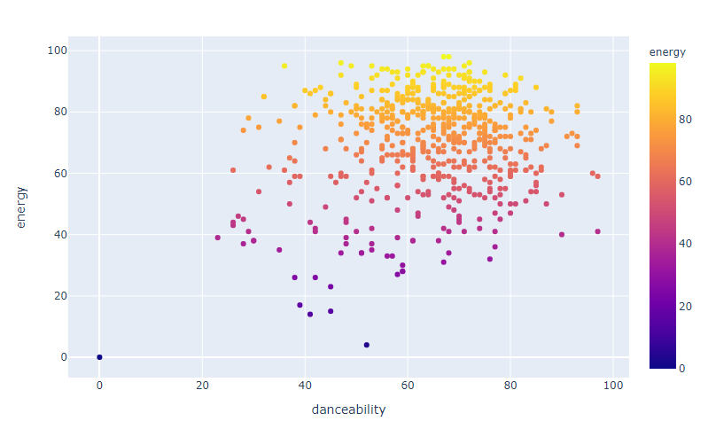
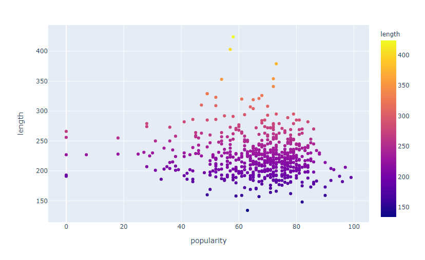
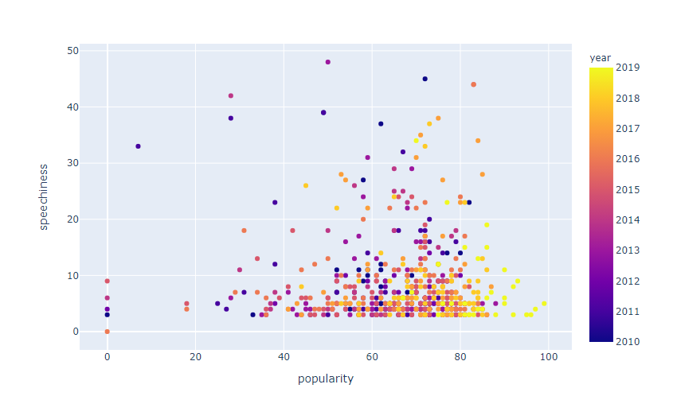

## Analyzing top songs on Spotify from 2010-19

### For interactive kernel on Kaggle - see [here](https://www.kaggle.com/saiyan6174/eda-on-top-spotify-songs)

This repository explores all the top songs on Spotify from 2010-19.
This helps to understand what are the common things between the songs that reach to the top of Spotify charts at the end of every year. Also, helps to gain some cool insights.
For this, I found a [dataset](https://www.kaggle.com/leonardopena/top-spotify-songs-from-20102019-by-year) on Kaggle.

Listed all cool insights - [here](https://github.com/jithendrabsy/DS-ML-Projects/blob/main/datascience-meets-music/analyzing-top-spotify-songs_from-2010-19/insights.md)

### Some insights

**Top genres on Spotify during 2010-19:**

- There are 50 unique genres in the top spotify songs from 2010-19
- During this timeperiod, most of the top songs belongs to the pop genre
- And in particular, dance-pop is the top genre on Spotify during this period.

**Top Artists on Spotify during 2010-19:**

- There are 184 unique artists whose songs reached top in the charts on Spotify in the timeperiod of 2010-19.
- Katy Perry has most number of top songs on Spotify in the period of 2010-19 followed by Justin Bieber .

**Beats per minute distribution among top songs:**

- Most of the top songs are having 100-150 beats per minute(bpm)
- Very few songs are having bpm > 200
- Only 3 songs are having bpm > 200 (you can see the value if you hover the pie chart above)
- Just out of curiosity, Let's see what are those 3 songs with bpm>200

**Year wise Danceability:**

- The top two songs which are easier to dance are of two female hiphop artists, Nicki Minaj and CardiB.
- CardiB's "Drip" released in 2018 is the song with highest danceability followed by Nicki Minaj's "Anaconda" in 2014.
- Imagine Dragon's "Bad Liar" ia also the song with danceability equal to Drip, thus there are two songs with highest danceablity.

**Year wise Popularity:**

- Maroon5's "Memories" is the most popular song during the period of 2010-19.

**Year wise Energy:**

- The most energetic song during this period is "Hello" by French DJ, Martin Solveig.

**Energy vs Danceability:**

- Danceability increases as energy increases.
- "Pom Poms" by Jonas Brothers is the song with highest energy among the top songs during this period.
- Even though the energy is less than half of the top songs, Bad Liar by Imagine Dragons is the song with highest danceability during 2010-19.

**Duration vs Popularity:**

- It is very clear that most of the popular songs are with duration less than 4 minutes(250 seconds)
- The song with highest duration is "TKO" by Justin Timberlake which is 7 minutes(424 seconds)
- The song with least duration is "Mark my words" by Justin Bieber which is just 2.2 minutes(134 seconds)

**Speechiness vs Popularity:**

- The most popular songs contain less spoken words
- The song with more spoken words is "How ya doin'?" by Little Mix feauturing Missy Elliot.

**2019 Top Artists and popularity:**

- Maroon5's "Memories" is the most popular song in 2019.
- EdSheeran has 5 top songs in 2019.

#### Exploring Music is fun ;)
